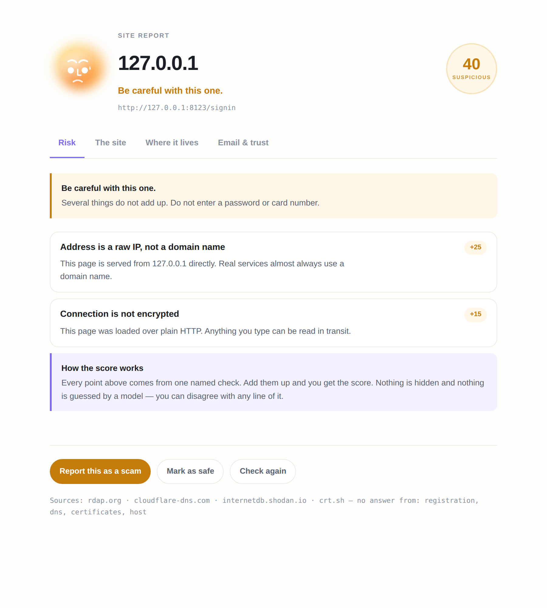

<div align="center">


# Pagida

**A phishing detector for Chrome that shows its working.**

Iris checks every page you open and tells you, in a sentence, whether to trust
it — then shows you every single reason behind that answer. No machine-learning
black box, no account, no tracking. Scoring happens on your machine; the only
thing that ever leaves it is a domain name.

[](https://github.com/AryannDhingraa/pagida/actions/workflows/ci.yml)
[](LICENSE)
[](src/manifest.json)
[](test)

*παγίδα — Greek for "trap".*

**Coming to the Chrome Web Store.** Until then, [grab the latest release](https://github.com/AryannDhingraa/pagida/releases)
and load it unpacked — [three steps, below](#install).

</div>

---

<div align="center">


<sub><a href="docs/pagida-demo.mp4">Watch with sound (28s)</a></sub>

</div>

---

<div align="center">

</div>

---

## What it does

Pagida scores the page you are on against **38 rules across four tiers**, then
shows you the verdict, the score, and every single rule that fired with the
actual evidence that made it fire.

Two things it does differently. The first is Iris — she sits in the toolbar, her
expression changes with the risk before you have read anything, and she steps
onto the page itself when something is genuinely wrong. The second is that the
reasoning is all there, in ordinary words:

> **Login form sends your password elsewhere** &nbsp;`+32`
> The password box on this page submits to `collector-node4.tk`, not to
> `verify-account.tk`. That is how stolen credentials are collected.

You can disagree with it, and you can learn from it. Both matter more than the
number.

## The site report

A verdict tells you what to do. A report tells you why you should believe it.
Open it from the popup and Pagida gathers everything it can find about a domain
from free public sources — no key, no account, nothing sent but the domain name
and an IP address:

| Tab | What it answers |
|---|---|
| **Risk** | Every signal that fired, its weight, and how the score is built |
| **The site** | Who registered the name, when, through whom, and how long it has actually been a live website |
| **Where it lives** | The IP, other names on it, what ports are open, and any publicly recorded weaknesses |
| **Email & trust** | Whether the domain can send mail, and whether it publishes SPF and DMARC |

Every field that cannot be fetched shows as **Unknown** rather than being left
out, because a blank row is a lie by omission when the whole point is helping
someone judge a site for themselves.

## Install

**From the Chrome Web Store** — *listing pending review, link goes here.*

**From source:**

```bash
git clone https://github.com/AryannDhingraa/pagida.git
cd pagida
npm install
npm run build
```

Then open `chrome://extensions`, turn on **Developer mode**, click **Load
unpacked**, and select the `dist` folder.

## How the scoring works

Three tiers. The first two are free, instant and entirely offline. The third
needs a network lookup and every part of it can be switched off.

### Tier 1 — the address (21 rules, offline)

| Signal | Weight |
|---|---:|
| Hostname mixes two alphabets (`аpple.com` with a Cyrillic а) | +30 |
| Domain is a near-miss for a known brand (`paypall.com`) | +30 |
| Brand name in the subdomain, not the real domain (`paypal.secure-billing.xyz`) | +30 |
| Domain reads as a brand using lookalike characters (`paypa1.com`) | +32 |
| Exact brand name under a generic TLD the brand does not use (`netflix.support`) | +28 |
| Page served from a WordPress system folder (`/wp-includes/…`) | +28 |
| Raw IP address instead of a domain name | +25 |
| Your email address embedded in the link | +22 |
| Credentials hidden in the address (`https://paypal.com@evil.tk/`) | +20 |
| Long random-looking token in the path | +18 |
| Trust words stuffed into the hostname (`secure-verify-account…`) | +10…18 |
| Free-registration TLD (`.tk`, `.ml`, `.ga`, `.cf`, `.gq`) | +15 |
| Connection is not encrypted | +15 |
| Part of the hostname looks auto-generated (`e5o6x7os`, `8acd0e`) | +14 |
| Hostname is a hyphenated phrase (`request-review-business-for.…`) | +14 |
| Executable file in the path (`.exe`, `.scr`, `.msi`…) | +15 |
| Hosted free on a per-user platform (`*.pages.dev`, `*.netlify.app`) | +12 |
| Non-Latin internationalised domain | +12 |
| Heavily-abused generic TLD (`.top`, `.xyz`, `.buzz`…) | +8 |
| Machine-looking domain name, deep subdomain nesting, very long URL | +5…8 |
| Shortened link | +5 |

### Tier 2 — the page itself (9 rules, offline)

| Signal | Weight |
|---|---:|
| Password box on an unencrypted page | +35 |
| Login form submits to a different site | +32 |
| Login form submits over plain HTTP from an HTTPS page | +30 |
| Page presents itself as a brand that does not own the domain | +16…24 |
| Sign-in page for a brand that does not own this site *(compound)* | +22 |
| Brand-new domain asking for a password *(compound)* | +20 |
| Navigation links all go nowhere — a copied login page | +18 |
| Tab icon borrowed from another site | +14 |
| Page blocks paste or right-click | +10…14 |
| Hidden or zero-sized frames, obfuscated inline scripts | +9…14 |

### Tier 3 — reputation (5 rules, network)

| Signal | Weight | Sends |
|---|---:|---|
| Google Safe Browsing threat match | +85 | The full URL, to Google. **Off unless you add your own key.** |
| Exact URL on the OpenPhish blocklist | +80 | Nothing — the list is downloaded and matched locally. |
| Host on the OpenPhish blocklist | +55 | Nothing. |
| Domain registered in the last 7 / 30 / 90 days | +30 / +25 / +12 | The domain name only, to `rdap.org`. Cached for a week. |
| Domain older than two years | **−10** | As above. |

### Bands

| Score | Band | What happens |
|---:|---|---|
| 0–14 | `NO_ISSUES_FOUND` | No badge |
| 15–29 | `WORTH_A_LOOK` | Blue `!` badge |
| 30–54 | `SUSPICIOUS` | Amber `!!` badge |
| 55–100 | `LIKELY_PHISHING` | Red `!!!` badge **and** a dismissible warning bar |

Only the top band interrupts you. That is deliberate — see
[the evaluation](EVALUATION.md) for why.

## Measured, not asserted

Most portfolio projects claim their detector works. This one has a harness you
can run yourself: `npm run evaluate` scores today's confirmed-phishing feed
against 2,000 legitimate sites and 40 hand-picked real brand login pages, then
prints precision, recall and F1 at every threshold.

Latest run — **URL tier only**, on 300 confirmed phishing URLs vs 2,040 legitimate ones:

| Band | Threshold | Precision | Recall | False positives |
|---|---:|---:|---:|---:|
| `WORTH_A_LOOK` | ≥15 | **94.5%** | **62.7%** | 11 / 2,040 |
| `SUSPICIOUS` | ≥30 | **97.8%** | 30.3% | 2 / 2,040 |
| `LIKELY_PHISHING` | ≥55 | **100%** | 2.3% | **0 / 2,040** |

**0 false positives** across 40 real brand login URLs — the PayPal, myGov,
CommBank, Microsoft and AWS sign-in pages that a naive "does the URL say
*login*?" heuristic destroys itself on.

[**EVALUATION.md**](EVALUATION.md) has the methodology, the honest caveats, and
what the numbers do *not* mean.

## Privacy

In normal use Pagida makes three network requests, all optional, all switchable
off in Options, and **none of them carries a page you visited**:

1. **The Pagida service** — a bare domain name (`example.com`), to check
   Google's list of sites caught spreading scams and malware. That list needs a
   paid key, so Pagida holds one and asks on your behalf, free and with no
   sign-up. The server refuses any request containing a path, and stores
   nothing — no IP, no history, no logs. Its source is in `proxy/worker.js`.
2. **`rdap.org`** — the registrable domain only, to find out how old it is.
   Never the path, never the query string. Cached for seven days.
3. **`raw.githubusercontent.com`** — downloads the OpenPhish public blocklist
   once every 12 hours. The matching then happens on your machine.

Opening a site report adds six more domain-level lookups, listed in
[PRIVACY.md](PRIVACY.md), and only while the report is open.

Using **your own** Safe Browsing key is a fourth option and it is **off by
default**, because it is the one lookup that sends the full address of every
page you open to a third party.

There is no analytics, no account, no `chrome.storage.sync`, and no
telemetry of any kind. [PRIVACY.md](PRIVACY.md) is the long version;
[THREAT-MODEL.md](THREAT-MODEL.md) covers what Pagida can and cannot protect you
from.

## Marking sites yourself

Your judgement beats the score. Two buttons in the popup, and two items in the
right-click menu on any link:

- **Report as phishing** — the site is forced to the top band from then on, and
  Pagida offers to open PhishTank so you can contribute it upstream. Nothing is
  submitted automatically.
- **Mark as safe** — scoring is switched off for that host entirely.
- **Right-click any link → Check this link with Pagida** — scores a link
  *without opening it*.

Everything you mark is listed in Options, removable one by one, and exportable
as JSON.

<div align="center">

</div>

## Permissions, and why each one is needed

| Permission | Why |
|---|---|
| `storage` | Your settings, the cached blocklist, and the sites you have marked. Local only — never synced. |
| `contextMenus` | The two right-click items for checking and reporting a link. |
| `alarms` | Refreshing the blocklist every 12 hours. |
| `content_scripts` on all http/https pages | A phishing detector has to be able to look at the page you are on. It reads the page and sends a fixed-shape summary — never page text, never form values. |
| `https://rdap.org/*` | Domain-age lookups. |
| `https://raw.githubusercontent.com/*` | The OpenPhish blocklist. |
| `https://safebrowsing.googleapis.com/*` | Only used if you enable Safe Browsing and provide a key. |
| `https://cloudflare-dns.com/*` | DNS lookups for the site report — mail records, SPF, DMARC. |
| `https://internetdb.shodan.io/*` | Reads Shodan's public record of an IP for the site report. Pagida never scans anything itself. |
| `https://crt.sh/*` | Certificate history for the site report — when a site first went live. |

There is no `tabs` permission. Pagida never reads your tab list or your history.

## Architecture

```
src/
├── core/              ← pure TypeScript, zero browser APIs
│   ├── rules/         ← url · dom · reputation · compound
│   ├── util/          ← domain parsing, edit distance, homographs, entropy
│   ├── data/          ← brands, TLD lists, generated allowlist
│   ├── evidence.ts    ← URL → PageEvidence
│   └── score.ts       ← PageEvidence → Verdict
├── ui/                ← iris (the mascot) · stepper — shared across every page
├── content/           ← reads the page, sends a summary, brings Iris onto it
├── background/        ← service worker: orchestration, caching, context menus
├── services/          ← rdap · feeds · safebrowsing · dns · netinfo · certs · report
├── popup/ options/ report/
└── manifest.json
```

The one design decision everything else follows from: **`src/core` has no
browser APIs.** That is what lets the Node evaluation harness import the exact
same scoring code the extension runs, so the published metrics measure the
shipped engine rather than a reimplementation of it.

## Development

```bash
npm install
npm run dev          # rebuild on change — load dist/ as an unpacked extension
npm test             # 79 unit tests
npm run typecheck
npm run lint
npm run evaluate     # fetch today's feeds and re-measure
npm run build:allowlist   # regenerate the well-known-domain list
npm run zip          # package for the Chrome Web Store
```

## Known limitations

Stating these is the point, not an apology. A security tool that hides its
blind spots is worse than one that has them.

- **The address tier misses most compromised-site phishing.** Roughly two thirds
  of live phishing runs on hacked legitimate sites and free hosting, where the
  URL genuinely looks fine. The page-content tier is what catches those, and it
  only runs on pages you actually open.
- **Public-suffix parsing is approximate.** Pagida ships a compact suffix list
  plus a country-code heuristic rather than the full 230KB Public Suffix List.
  Exotic suffixes can be mis-parsed, which weakens brand comparison — it never
  invents a verdict on its own.
- **The brand list is finite.** ~100 brands, weighted towards what Australian
  users actually get targeted with. A brand that is not on the list gets no
  impersonation detection.
- **No machine learning, by choice.** A trained classifier would likely improve
  recall and would definitely destroy the explanation, which is the entire
  point of the tool. It is on the roadmap as an *additional* tier, never as a
  replacement.
- **DOM inspection is heuristic.** Inline paste-blockers are detectable;
  handlers added by JavaScript are not.

## Roadmap

- [ ] Chrome Web Store listing (submitted, in review)
- [ ] Miner and skimmer detection — the one thing Netcraft does that Pagida does not
- [ ] Firefox build — the code is MV3, the manifest needs a variant
- [ ] Full Public Suffix List, compiled down at build time
- [ ] A second opinion tier: optional VirusTotal and urlscan.io enrichment
- [ ] An offline-trained model as a fourth tier, with per-feature attributions
      so the explanation survives

## A note on the licence terms of the data sources

Pagida is free and open source, and it stays that way for a concrete reason:
**Google Safe Browsing is free for non-commercial use only**, and the VirusTotal
public API forbids commercial products outright. Charging for Pagida would mean
migrating to Google Web Risk and VirusTotal Premium — both paid. That trade-off
is documented here rather than discovered later.

## Contributing

Issues and pull requests welcome — see [CONTRIBUTING.md](CONTRIBUTING.md). If
you have found a security problem in Pagida itself, [SECURITY.md](SECURITY.md)
tells you how to report it.

## Licence

MIT © Aryan Dhingra. Phishing data from the
[OpenPhish community feed](https://github.com/openphish/public_feed); domain
registration data via [RDAP](https://rdap.org).
